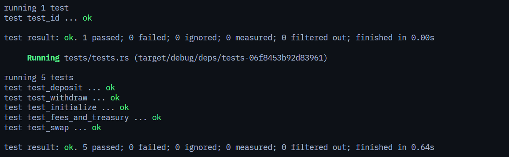

# Automated Market Maker (AMM) - Solana & Anchor

An implementation of a Constant Product Automated Market Maker (`x * y = k`) on Solana, built using the **Anchor Framework (v1.0.1)** and tested with **LiteSVM**.

---

## 📖 Table of Contents

- [Overview](#overview)
- [AMM Mechanism & Mathematics](#amm-mechanism--mathematics)
  - [1. Constant Product Invariant](#1-constant-product-invariant)
  - [2. Liquidity Provisioning (Deposit)](#2-liquidity-provisioning-deposit)
  - [3. Liquidity Removal (Withdraw)](#3-liquidity-removal-withdraw)
  - [4. Swaps & Fee Structure](#4-swaps--fee-structure)
- [Architecture & Program State](#architecture--program-state)
  - [Account Structures](#account-structures)
  - [PDA Seed Derivations](#pda-seed-derivations)
- [Instruction Implementation](#instruction-implementation)
  - [`initialize`](#initialize)
  - [`deposit`](#deposit)
  - [`withdraw`](#withdraw)
  - [`swap`](#swap)
- [Project Layout](#project-layout)
- [Building & Running Tests](#building--running-tests)
- [Test Suite & Screenshot](#test-suite--screenshot)
  - [Test Cases Summary](#test-cases-summary)
  - [Test Execution Output](#test-execution-output)
  - [Test Screenshot Space](#test-screenshot-space)

---

## Overview

This repository implements a decentralized Automated Market Maker (AMM) protocol on Solana supporting:
- **Constant Product Curve** pricing (`x * y = k`).
- **Dual-Token Liquidity Pools** (Token X and Token Y).
- **Proportional LP Token Minting & Burning** for liquidity providers.
- **Configurable Fees**: Total swap fee (in basis points) with protocol fee splitting sent directly to a protocol treasury.
- **Slippage Protection**: Maximum input bounds on deposits, minimum output bounds on withdrawals and swaps.
- **Pool Authority & Safety Locks**: Optional emergency lock to pause deposits, withdrawals, and swaps.

---

## AMM Mechanism & Mathematics

### 1. Constant Product Invariant

The pool maintains the constant product curve invariant:

```
k = x * y
```

where:
- `x` is the pool's reserve balance of Token X (`vault_x`).
- `y` is the pool's reserve balance of Token Y (`vault_y`).
- `k` is the invariant constant (which grows over time as LP fees accumulate in the pool).

---

### 2. Liquidity Provisioning (Deposit)

- **Initial Deposit (`lp_supply == 0`):**
  The first liquidity provider establishes the initial pool price ratio by depositing `x = max_x` and `y = max_y`, receiving `amount` LP tokens.

- **Subsequent Deposits (`lp_supply > 0`):**
  Required deposit amounts are calculated proportionally to maintain the existing pool reserve ratio:

  ```
  x_deposit = (lp_amount * vault_x_reserve) / lp_supply
  y_deposit = (lp_amount * vault_y_reserve) / lp_supply
  ```

  **Slippage Bounds:**
  - `x_deposit <= max_x`
  - `y_deposit <= max_y`

---

### 3. Liquidity Removal (Withdraw)

When burning `lp_amount` LP tokens, the provider receives their proportional share of both pool reserves:

```
x_withdraw = (lp_amount * vault_x_reserve) / lp_supply
y_withdraw = (lp_amount * vault_y_reserve) / lp_supply
```

**Slippage Bounds:**
- `x_withdraw >= min_x`
- `y_withdraw >= min_y`

---

### 4. Swaps & Fee Structure

When a trader swaps `amount_in` of tokens into the pool:

1. **Protocol Fee Calculation:**
   ```
   protocol_fee_amount = (amount_in * protocol_fee_bps) / 10_000
   ```
   Transferred directly from the user's token account to the `treasury` token account via CPI.

2. **Total Fee & Swap Output Calculation:**
   Using the constant product formula with fee deduction:
   ```
   total_fee_amount = (amount_in * fee_bps) / 10_000
   effective_amount_in = amount_in - total_fee_amount

   // For Swap Token X -> Token Y:
   amount_out = (vault_y_reserve * effective_amount_in) / (vault_x_reserve + effective_amount_in)
   ```

3. **Reserve & Vault Updates:**
   - User deposits `net_deposit = amount_in - protocol_fee_amount` into `vault_x`.
   - User receives `amount_out` from `vault_y`.
   - The remaining LP fee `(total_fee_amount - protocol_fee_amount)` stays inside the vault reserves, increasing `k` for all liquidity providers.
   - **Slippage Enforcement:** `amount_out >= min_amount_out`

---

## Architecture & Program State

### Account Structures

#### `Config`
The central pool state PDA:

```rust
#[account]
#[derive(InitSpace)]
pub struct Config {
    pub seed: u64,                 // Unique seed to allow multiple pools
    pub authority: Option<Pubkey>, // Optional authority with permission to lock/manage pool
    pub mint_x: Pubkey,            // Mint address for Token X
    pub mint_y: Pubkey,            // Mint address for Token Y
    pub fee: u16,                  // Total swap fee in basis points (1 bps = 0.01%)
    pub protocol_fee: u16,         // Protocol fee portion in basis points
    pub treasury: Pubkey,          // Treasury address receiving protocol fees
    pub locked: bool,              // Emergency pause flag
    pub config_bump: u8,           // Bump seed for config PDA
    pub lp_bump: u8,               // Bump seed for LP mint PDA
}
```

### PDA Seed Derivations

| Account | PDA Seeds | Description |
|---|---|---|
| **Config** | `[b"config", seed.to_le_bytes()]` | Holds pool configuration and state |
| **LP Mint** | `[b"lp", config.key()]` | Mint account for LP tokens (decimals: 6) |
| **Vault X** | Associated Token Account (`config`, `mint_x`) | Token X pool reserve vault |
| **Vault Y** | Associated Token Account (`config`, `mint_y`) | Token Y pool reserve vault |

---

## Instruction Implementation

### `initialize`
Initializes a new pool and creates all associated accounts:
- Creates the `Config` account PDA.
- Validates that `protocol_fee <= fee`.
- Initializes the `mint_lp` token mint with the `config` PDA as the mint authority.
- Initializes `vault_x` and `vault_y` Associated Token Accounts owned by the `config` PDA.

### `deposit`
Allows liquidity providers to deposit tokens and receive LP tokens:
- Verifies pool is unlocked (`!config.locked`) and `amount > 0`.
- For initial deposit: accepts `max_x` and `max_y`.
- For subsequent deposits: computes exact `x` and `y` required from `ConstantProduct::xy_deposit_amounts_from_l`.
- Verifies slippage thresholds: `x <= max_x` and `y <= max_y`.
- Executes CPI token transfers from user to vaults.
- Executes CPI mint to mint LP tokens to the user's LP token account.

### `withdraw`
Allows liquidity providers to burn LP tokens and redeem underlying assets:
- Verifies pool is unlocked (`!config.locked`) and `amount > 0`.
- Computes proportional withdrawal amounts using `ConstantProduct::xy_withdraw_amounts_from_l`.
- Verifies slippage thresholds: `x >= min_x` and `y >= min_y`.
- Burns LP tokens from user's ATA via CPI.
- Transfers Token X and Token Y from pool vaults to user ATAs signed by `config` PDA.

### `swap`
Executes token swaps between Token X and Token Y:
- Verifies pool is unlocked (`!config.locked`) and `amount_in > 0`.
- Calculates protocol fee and executes CPI transfer of protocol fee to `treasury` ATA.
- Calculates swap curve output via `ConstantProduct::swap`.
- Enforces slippage: `amount_out >= min_amount_out`.
- Deposits net input tokens into the source vault and transfers output tokens from destination vault to user ATA via CPI.

---

## Project Layout

```
amm_q3_26/
├── Anchor.toml                      # Anchor workspace configuration
├── Cargo.toml                       # Rust workspace definition
├── package.json                     # Node/Yarn dependencies
├── programs/
│   └── amm_q3_26/
│       ├── Cargo.toml               # Program & test dependencies
│       └── src/
│           ├── lib.rs               # Program entrypoint & instruction routing
│           ├── state.rs             # Config account definition
│           ├── constants.rs         # Seed constants
│           ├── error.rs             # AmmError enum & CurveError mapping
│           ├── instructions.rs      # Instruction module exports
│           └── instructions/
│               ├── initialize.rs    # Pool initialization logic
│               ├── deposit.rs       # Liquidity deposit logic
│               ├── withdraw.rs      # Liquidity withdrawal logic
│               └── swap.rs          # Token swapping & fee routing logic
│       └── tests/
│           ├── tests.rs             # LiteSVM integration test suite
│           └── ix_handlers/         # Test instruction builders & setup helpers
│               ├── mod.rs
│               ├── init.rs
│               ├── deposit.rs
│               ├── withdraw.rs
│               └── swap.rs
└── assets/                          # Screenshots & documentation assets
```

---

## Building & Running Tests

### Prerequisites

- [Rust & Cargo](https://www.rust-lang.org/tools/install) (nightly / 1.79+)
- [Solana CLI](https://docs.solanalabs.com/cli/install) (v1.18+)
- [Anchor CLI](https://www.anchor-lang.com/docs/installation) (v0.30+)

### 1. Build Program

Build the SBF shared library:

```bash
anchor build --ignore-keys
```

*(Or `anchor build` after running `anchor keys sync`)*

### 2. Run Tests

Run the LiteSVM integration tests:

```bash
cargo test -- --nocapture
```

---

## Test Suite & Screenshot

### Test Cases Summary

All test cases are written using **LiteSVM** for fast, deterministic, in-memory Solana runtime testing without needing a local validator node:

1. **`test_initialize`**: Verifies creation of the `Config` PDA, LP Mint PDA, and both token vaults with custom fee settings.
2. **`test_deposit`**: Verifies initial liquidity provisioning and LP token minting to the provider.
3. **`test_withdraw`**: Verifies burning of LP tokens and proportional redemption of reserve assets.
4. **`test_swap`**: Tests token swaps with constant product curve invariant and slippage boundaries.
5. **`test_fees_and_treasury`**: Validates exact fee calculations and asserts that protocol fee basis points are correctly routed to the protocol treasury ATA.

---

### Test Execution Output

```text
running 1 test
test test_id ... ok

test result: ok. 1 passed; 0 failed; 0 ignored; 0 measured; 0 filtered out; finished in 0.00s

     Running tests/tests.rs (target/debug/deps/tests-06f8453b92d83961)

running 5 tests
test test_initialize ... ok
test test_swap ... ok
test test_deposit ... ok
test test_fees_and_treasury ... ok
test test_withdraw ... ok

test result: ok. 5 passed; 0 failed; 0 ignored; 0 measured; 0 filtered out; finished in 1.36s
```

---

### Test Screenshot Space



*Figure: LiteSVM Integration Test Suite Passing.*

---
