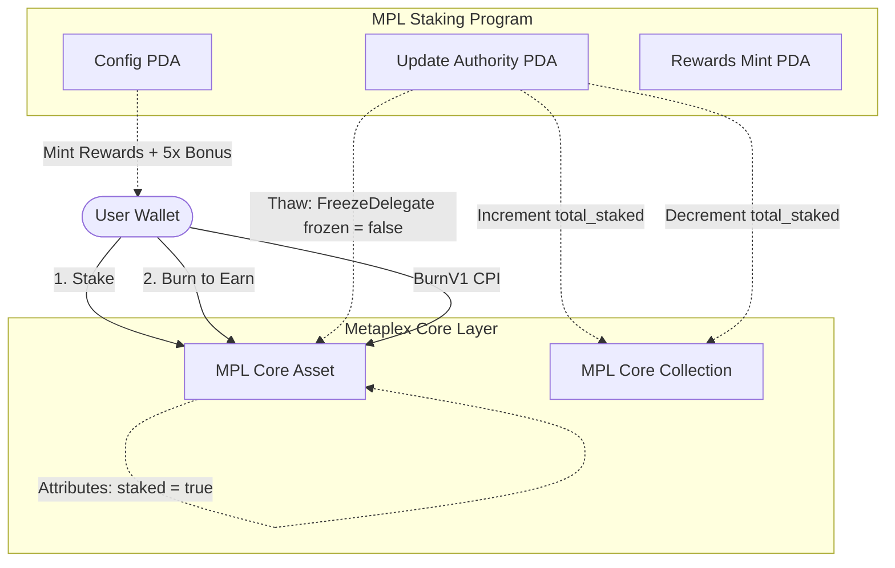

# MPL-Core NFT Staking & Burn-to-Earn Protocol

A decentralized Solana NFT staking and **Burn-to-Earn** protocol built with **Anchor** and **Metaplex Core (MPL-Core)**.

---

## 🌟 Features

- **Metaplex Core Plugin Architecture**: Utilizes `FreezeDelegate` to lock NFTs directly in the user's wallet without custody transfer.
- **Dynamic On-Chain Attributes**: Tracks staking status (`staked`, `staked_at`) via the Core `Attributes` plugin on individual assets.
- **Collection-Level Analytics**: Maintains a real-time `total_staked` counter on the Collection account using Metaplex Core Collection Attributes.
- **Periodic Staking Rewards**: Calculates and mints custom reward tokens (SPL Token / Token-2022) to user ATAs based on elapsed lockup time.
- **Burn-to-Earn Mechanism**: Allows users to permanently burn their staked Core NFT to receive accumulated rewards plus a 5x one-time bonus payout and rent reclamation.
- **Rust Integration Test Suite**: Complete test coverage for PDA derivation, instruction encoding, rewards math, and collection counters.

---

## 🏗️ Architecture & Core Mechanics



---

## 📋 Instructions Breakdown

### 1. `initialize`
Initializes the staking configuration and creates the rewards token mint with the `config` PDA as the mint authority.

```rust
// programs/mpl-staking/src/instructions/initialize.rs
pub fn handler(ctx: Context<Initialize>, rewards_bps: u16, freeze_period: u16) -> Result<()> {
    ctx.accounts.config.set_inner(Config {
        rewards_bps,
        freeze_period,
        rewards_bump: ctx.bumps.rewards_mint,
        bump: ctx.bumps.config,
    });
    Ok(())
}
```

---

### 2. `stake`
Freezes the user's NFT in their wallet with `FreezeDelegate`, tags staking metadata via `Attributes`, and increments the collection-level `total_staked` counter.

```rust
// programs/mpl-staking/src/instructions/stake.rs
// 1. Tag NFT with staking attributes
AddPluginV1CpiBuilder::new(&ctx.accounts.mpl_core_program.to_account_info())
    .asset(&ctx.accounts.asset.to_account_info())
    .collection(Some(&ctx.accounts.collection.to_account_info()))
    .payer(&ctx.accounts.owner.to_account_info())
    .authority(Some(&ctx.accounts.update_authority.to_account_info()))
    .plugin(Plugin::Attributes(Attributes { attribute_list }))
    .init_authority(PluginAuthority::UpdateAuthority)
    .invoke_signed(&[signer_seeds])?;

// 2. Freeze asset in-place
AddPluginV1CpiBuilder::new(&ctx.accounts.mpl_core_program.to_account_info())
    .asset(&ctx.accounts.asset.to_account_info())
    .plugin(Plugin::FreezeDelegate(FreezeDelegate { frozen: true }))
    .init_authority(PluginAuthority::UpdateAuthority)
    .invoke()?;

// 3. Increment Collection total_staked counter
UpdateCollectionPluginV1CpiBuilder::new(&ctx.accounts.mpl_core_program.to_account_info())
    .collection(&ctx.accounts.collection.to_account_info())
    .plugin(Plugin::Attributes(Attributes { attribute_list: collection_attributes }))
    .invoke_signed(&[signer_seeds])?;
```

---

### 3. `unstake`
Validates that the minimum freeze period has elapsed, thaws the asset, updates staking attributes to `staked = false`, decrements the collection `total_staked` counter, and mints accumulated rewards.

```rust
// programs/mpl-staking/src/instructions/unstake.rs
// Thaw asset
UpdatePluginV1CpiBuilder::new(&ctx.accounts.mpl_core_program.to_account_info())
    .asset(&ctx.accounts.asset.to_account_info())
    .plugin(Plugin::FreezeDelegate(FreezeDelegate { frozen: false }))
    .invoke_signed(&[signer_seeds])?;

// Mint accumulated rewards
mint_to_checked(
    CpiContext::new_with_signer(
        ctx.accounts.token_program.to_account_info(),
        MintToChecked {
            mint: ctx.accounts.rewards_mint.to_account_info(),
            to: ctx.accounts.user_rewards_ata.to_account_info(),
            authority: ctx.accounts.config.to_account_info(),
        },
        config_signer_seeds,
    ),
    amount,
    ctx.accounts.rewards_mint.decimals,
)?;
```

---

### 4. `burn_staked_nft` (Burn to Earn)
Allows users to sacrifice their staked NFT for a large one-time payout:
1. Thaws the frozen NFT via the `update_authority` PDA.
2. Permanently destroys the NFT asset via `BurnV1`, refunding the asset's rent lamports to the owner.
3. Decrements `total_staked` on the collection attributes.
4. Mints accumulated rewards **plus a 5x burn bonus** directly into the user's ATA.

```rust
// programs/mpl-staking/src/instructions/burn_staked_nft.rs
// Burn the Metaplex Core NFT
BurnV1CpiBuilder::new(&ctx.accounts.mpl_core_program.to_account_info())
    .asset(&ctx.accounts.asset.to_account_info())
    .collection(Some(&ctx.accounts.collection.to_account_info()))
    .payer(&ctx.accounts.owner.to_account_info()) // Receives refunded rent lamports
    .authority(Some(&ctx.accounts.owner.to_account_info()))
    .invoke()?;

// Mint rewards with 5x multiplier
let total_burn_payout = base_reward.checked_mul(5).ok_or(ErrorCode::InvalidRewardsBps)?;
mint_to_checked(
    CpiContext::new_with_signer(
        ctx.accounts.token_program.to_account_info(),
        MintToChecked {
            mint: ctx.accounts.rewards_mint.to_account_info(),
            to: ctx.accounts.user_rewards_ata.to_account_info(),
            authority: ctx.accounts.config.to_account_info(),
        },
        &[&config_seeds[..]],
    ),
    total_burn_payout,
    ctx.accounts.rewards_mint.decimals,
)?;
```

---

## 🔑 PDA Seed Reference

| Account | Seeds | Description |
| :--- | :--- | :--- |
| **Config** | `[b"config", collection.key()]` | Stores protocol parameters & rewards config |
| **Update Authority** | `[b"update_authority", collection.key()]` | Core plugin authority for freezing, thawing & attributes |
| **Rewards Mint** | `[b"rewards_mint", config.key()]` | SPL token mint for staking rewards |

---

## 🧪 Testing & Verification

The project includes unit and integration tests under `programs/mpl-staking/tests/staking.rs`.

### Running Tests

```bash
cargo test
```

### Test Suite Execution Output


---

## 📁 Directory Structure

```text
mpl-staking/
├── programs/
│   └── mpl-staking/
│       ├── Cargo.toml
│       ├── src/
│       │   ├── lib.rs
│       │   ├── constants.rs
│       │   ├── error.rs
│       │   ├── instructions.rs
│       │   ├── state/
│       │   │   ├── mod.rs
│       │   │   └── config.rs
│       │   └── instructions/
│       │       ├── initialize.rs
│       │       ├── create_collection.rs
│       │       ├── mint_asset.rs
│       │       ├── stake.rs
│       │       ├── unstake.rs
│       │       ├── claim_rewards.rs
│       │       └── burn_staked_nft.rs
│       └── tests/
│           └── staking.rs
├── Anchor.toml
├── Cargo.toml
└── README.md
```

---

## 🛠️ Build Requirements

- **Rust**: `1.89.0` or higher (configured in `rust-toolchain.toml`)
- **Solana CLI**: `1.18.x` or higher
- **Anchor**: `0.31.1`
- **Metaplex Core**: `0.11.2`
