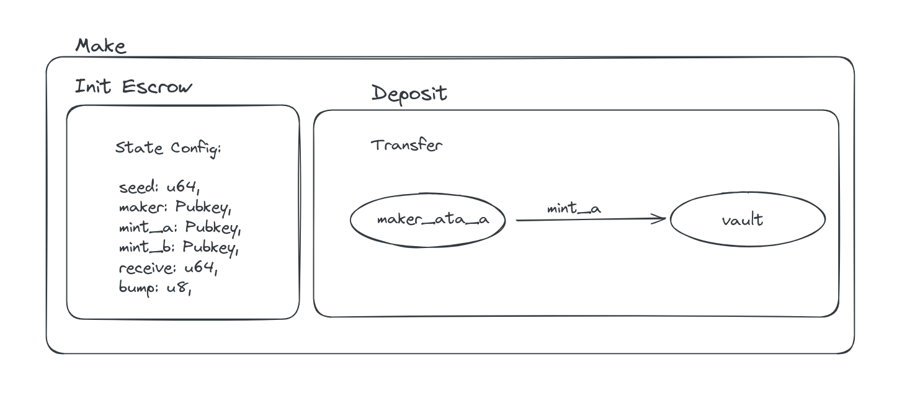
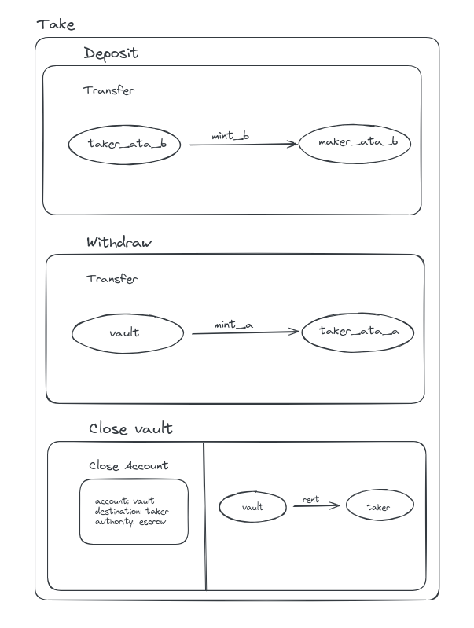
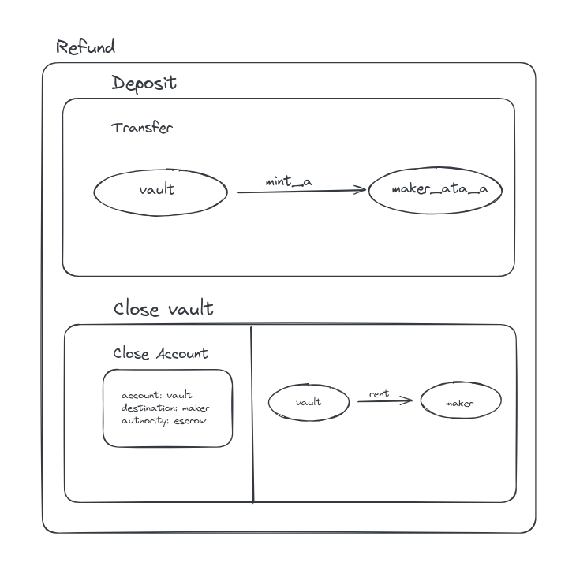

# Solana Timed Escrow Program (Anchor & LiteSVM)

[](https://solana.com)
[](https://www.rust-lang.org/)
[](https://github.com/LiteSVM/litesvm)
[](LICENSE)

A robust, production-grade **Timed Escrow Program** implemented in **Anchor** on Solana. This program enables trustless, peer-to-peer token swaps (supporting SPL Token and Token-2022 interfaces) with on-chain time-locking, deadline validation using the Solana `Clock` sysvar, maker expiration extension, and complete LiteSVM integration testing in Rust.

---

## 📑 Table of Contents

- [Overview](#-overview)
- [Key Features](#-key-features)
- [Program Architecture & Account Model](#-program-architecture--account-model)
- [Instruction Lifecycle](#-instruction-lifecycle)
  - [1. `make`](#1-make)
  - [2. `take`](#2-take)
  - [3. `refund`](#3-refund)
  - [4. `update`](#4-update)
- [Timed Escrow Mechanism (Extension Challenge)](#-timed-escrow-mechanism-extension-challenge)
- [Error Handling](#-error-handling)
- [Testing Suite (LiteSVM)](#-testing-suite-litesvm)
  - [Running the Tests](#running-the-tests)
  - [Test Scenarios Covered](#test-scenarios-covered)
  - [Test Execution Screenshot](#-test-execution-screenshot)
- [Project Directory Structure](#-project-directory-structure)
- [Security & Best Practices](#-security--best-practices)

---

## 🌟 Overview

In a decentralized environment, two untrusted parties (*Maker* and *Taker*) often want to swap Token A for Token B atomically without a centralized intermediary.

This escrow program facilitates atomic swaps by:
1. Allowing the **Maker** to deposit **Token A** into a Program-Derived Address (**PDA**) vault and define terms (target **Token B** amount and an **expiration timestamp**).
2. Allowing any **Taker** with sufficient **Token B** to fulfill the trade **before the deadline**, receiving Token A and sending Token B directly to the Maker.
3. Allowing the **Maker** to reclaim their deposited Token A via **Refund** once the deadline has passed.
4. Allowing the **Maker** to adjust/extend the expiration deadline via **Update** if market conditions require more time.

```
                    ┌────────────────────────────────────────┐
                    │               MAKE STEP                │
                    │  Maker deposits Token A into Vault PDA │
                    │    Sets Target Token B & Expiration    │
                    └───────────────────┬────────────────────┘
                                        │
                    ┌───────────────────┴───────────────────┐
                    │                                       │
            [Before Expiration]                     [After Expiration]
                    │                                       │
                    ▼                                       ▼
    ┌──────────────────────────────┐        ┌──────────────────────────────┐
    │          TAKE STEP           │        │         REFUND STEP          │
    │  Taker sends Token B → Maker │        │ Vault sends Token A → Maker  │
    │  Vault sends Token A → Taker │        │  Vault & Escrow PDAs closed  │
    │  Vault & Escrow PDAs closed  │        │     Rent refunded to Maker   │
    │    Rent refunded to Maker    │        └──────────────────────────────┘
    └──────────────────────────────┘
```

---

## 🚀 Key Features

- **SPL Token & Token-2022 Compatibility**: Uses `anchor_spl::token_interface` (`TransferChecked`, `Mint`, `TokenAccount`, `TokenInterface`) for compatibility across standard SPL tokens and Token Extensions.
- **Timed Escrow Locking**: Native timestamp enforcement via the Solana `Clock` sysvar (`Clock::get()?.unix_timestamp`).
- **Zero Locked Rent**: All PDA accounts (`Escrow` state and `Vault` token account) are closed upon swap completion or refund, returning 100% of the rent lamports back to the Maker.
- **Deadline Extension (`update`)**: Maker can update the escrow expiration timestamp at any time prior to completion without having to cancel and recreate the escrow.
- **High-Speed In-Memory Testing**: Verified via **LiteSVM**, Solana's blazing-fast in-process virtual machine test framework.

---

## 🏛 Program Architecture & Account Model

### 1. Escrow State Account

The `Escrow` account holds the parameters governing the swap:

| Field | Type | Description |
| :--- | :--- | :--- |
| `seed` | `u64` | Maker-defined entropy seed allowing multiple concurrent escrows per maker |
| `maker` | `Pubkey` | Public key of the maker who created the escrow and deposited Token A |
| `mint_a` | `Pubkey` | Mint address of Token A (deposited token) |
| `mint_b` | `Pubkey` | Mint address of Token B (requested token) |
| `receive` | `u64` | Exact amount of Token B required to settle the trade |
| `bump` | `u8` | Canonical bump seed for the Escrow PDA |
| `expiration` | `i64` | Unix timestamp deadline for the escrow |

### 2. PDA Derivations

- **Escrow PDA**:
  `Seeds = [b"escrow", maker.key().as_ref(), seed.to_le_bytes().as_ref()]`
- **Vault Token Account (ATA)**:
  `Address = get_associated_token_address(escrow_pda, mint_a)`

---

## 🔄 Instruction Lifecycle

### 1. `make`

The maker initiates the escrow by locking Token A into the program-controlled vault and setting swap parameters.



- **Discriminator**: `0`
- **Parameters**: `seed: u64`, `deposit: u64`, `receive: u64`, `expiration: i64`
- **Checks**:
  - `expiration > Clock::get()?.unix_timestamp` (must be a valid future timestamp).
- **Actions**:
  - Creates the `Escrow` PDA account.
  - Initializes the `Vault` Associated Token Account owned by the `Escrow` PDA.
  - Transfers `deposit` amount of Token A from `maker_ata_a` into `vault` using `transfer_checked`.

```rust
// programs/escrowq32026/src/instructions/make.rs
pub fn init_escrow(&mut self, seed: u64, receive: u64, bumps: &MakeBumps, expiration: i64) -> Result<()> {
    let current_time = Clock::get()?.unix_timestamp;
    require!(expiration > current_time, EscrowError::InvalidExpiration);
    self.escrow.set_inner(Escrow {
        seed,
        maker: self.maker.key(),
        mint_a: self.mint_a.key(),
        mint_b: self.mint_b.key(),
        receive,
        bump: bumps.escrow,
        expiration,
    });
    Ok(())
}
```

---

### 2. `take`

A taker fulfills the escrow by supplying the requested amount of Token B before the expiration time.



- **Discriminator**: `1`
- **Checks**:
  - `Clock::get()?.unix_timestamp <= escrow.expiration` (fails with `EscrowExpired` if expired).
  - Validates `maker`, `mint_a`, `mint_b` match the state in `Escrow`.
- **Actions**:
  - Transfers `escrow.receive` amount of Token B from `taker_ata_b` to `maker_ata_b`.
  - Transfers all Token A from `vault` to `taker_ata_a` signed by the `Escrow` PDA.
  - Closes `vault` token account and sends rent lamports to `maker`.
  - Closes `escrow` PDA account and sends rent lamports to `maker`.

```rust
// programs/escrowq32026/src/instructions/take.rs
pub fn transfer_to_maker(&mut self) -> Result<()> {
    let current_time = Clock::get()?.unix_timestamp;
    require!(current_time <= self.escrow.expiration, EscrowError::EscrowExpired);

    transfer_checked(
        CpiContext::new(self.token_program.key(), TransferChecked {
            from: self.taker_ata_b.to_account_info(),
            to: self.maker_ata_b.to_account_info(),
            mint: self.mint_b.to_account_info(),
            authority: self.taker.to_account_info(),
        }),
        self.escrow.receive,
        self.mint_b.decimals,
    )
}
```

---

### 3. `refund`

If the escrow expires without being fulfilled, the maker can reclaim their locked Token A.



- **Discriminator**: `2`
- **Checks**:
  - `Clock::get()?.unix_timestamp > escrow.expiration` (fails with `EscrowNotExpired` if attempted before deadline).
  - Maker must be the signer and match `escrow.maker`.
- **Actions**:
  - Transfers all Token A from `vault` back to `maker_ata_a` signed by the `Escrow` PDA.
  - Closes `vault` token account, sending rent lamports back to `maker`.
  - Closes `escrow` PDA account, returning rent lamports to `maker`.

```rust
// programs/escrowq32026/src/instructions/refund.rs
pub fn refund_and_close_vault(&mut self) -> Result<()> {
    let current_time = Clock::get()?.unix_timestamp;
    require!(current_time > self.escrow.expiration, EscrowError::EscrowNotExpired);

    let signer_seeds: [&[&[u8]]; 1] = [&[
        ESCROW_SEED,
        self.maker.key.as_ref(),
        &self.escrow.seed.to_le_bytes()[..],
        &[self.escrow.bump],
    ]];

    transfer_checked(
        CpiContext::new_with_signer(self.token_program.key(), TransferChecked {
            from: self.vault.to_account_info(),
            to: self.maker_ata_a.to_account_info(),
            mint: self.mint_a.to_account_info(),
            authority: self.escrow.to_account_info(),
        }, &signer_seeds),
        self.vault.amount,
        self.mint_a.decimals,
    )?;

    close_account(CpiContext::new_with_signer(self.token_program.key(), CloseAccount {
        account: self.vault.to_account_info(),
        destination: self.maker.to_account_info(),
        authority: self.escrow.to_account_info(),
    }, &signer_seeds))
}
```

---

### 4. `update`

The maker can update the expiration timestamp of an active escrow (e.g. extending an offer deadline).

- **Discriminator**: `3`
- **Parameters**: `expiration: i64`
- **Checks**:
  - Signer must be the `maker`.
  - `new_expiration > Clock::get()?.unix_timestamp` (must be in the future).
- **Actions**:
  - Mutates `escrow.expiration` to the new timestamp.

```rust
// programs/escrowq32026/src/instructions/update.rs
pub fn update_escrow(&mut self, expiration: i64) -> Result<()> {
    let current_time = Clock::get()?.unix_timestamp;
    require!(expiration > current_time, EscrowError::InvalidExpiration);
    self.escrow.expiration = expiration;
    Ok(())
}
```

---

## ⏱ Timed Escrow Mechanism (Extension Challenge)

The timed mechanism solves the common counterparty risk where a trade is left pending indefinitely or taker attempts to execute stale pricing:

1. **Deterministic Expiration Guarantees**:
   The maker specifies an exact Unix timestamp deadline.
2. **Clock Sysvar Verification**:
   The program queries `Clock::get()?.unix_timestamp` directly from the Solana runtime.
3. **Strict Time Boundaries**:
   - **`take`**: Requires `current_time <= expiration`.
   - **`refund`**: Requires `current_time > expiration`.
   - **`make` / `update`**: Requires `new_expiration > current_time`.

---

## ⚠️ Error Handling

Custom error codes defined in `programs/escrowq32026/src/error.rs`:

| Error Code | Error Message | Trigger Condition |
| :--- | :--- | :--- |
| `EscrowExpired` | `"The escrow has already expired."` | Attempting `take` when `current_time > expiration` |
| `InvalidExpiration` | `"The escrow expiration time must be in the future."` | Calling `make` or `update` with `expiration <= current_time` |
| `EscrowNotExpired` | `"The escrow has not expired yet."` | Calling `refund` when `current_time <= expiration` |

---

## 🧪 Testing Suite (LiteSVM)

The project includes an in-depth, end-to-end integration test suite written in Rust using [LiteSVM](https://github.com/LiteSVM/litesvm) (`litesvm` & `litesvm-token`).

### Running the Tests

```bash
cargo test
```

### Test Scenarios Covered

```
running 5 tests
test test_refund_before_expiration_fails ... ok
test test_update_expiration              ... ok
test test_make_and_refund               ... ok
test test_take_after_expiration_fails   ... ok
test test_make_and_take                 ... ok

test result: ok. 5 passed; 0 failed; 0 ignored; 0 measured; 0 filtered out; finished in 1.58s
```

1. **`test_make_and_refund`**:
   - Creates Mint A & Mint B, funds Maker ATA with 1,000 Token A.
   - Maker calls `make` with 10 Token A deposit and deadline `T = 17780206209`.
   - Verifies Vault PDA receives 10 Token A and Escrow state is properly initialized.
   - Advances LiteSVM Clock sysvar past expiration (`T = 17780206210`).
   - Maker executes `refund`.
   - Asserts Escrow PDA and Vault PDA are closed and Maker's balance is 100% restored (1,000 Token A).

2. **`test_make_and_take`**:
   - Sets up Maker (1,000 Token A) and Taker (1,000 Token B).
   - Maker calls `make` (deposit 10 Token A, asks 10 Token B, expiration `T = 10000`).
   - Taker calls `take` at `T = 0` (before deadline).
   - Verifies atomic swap: Taker receives 10 Token A, Maker receives 10 Token B, Taker retains 990 Token B.
   - Verifies Escrow and Vault accounts are closed and rent reclaimed.

3. **`test_update_expiration`**:
   - Maker creates Escrow with initial expiration `T = 500`.
   - Maker calls `update` to extend expiration to `T = 1500`.
   - Deserializes on-chain account state and confirms `expiration == 1500`.

4. **`test_refund_before_expiration_fails`**:
   - Maker creates Escrow with expiration `T = 10000`.
   - Maker attempts `refund` at `T = 0`.
   - Asserts transaction fails with error code corresponding to `EscrowNotExpired`.

5. **`test_take_after_expiration_fails`**:
   - Maker creates Escrow with expiration `T = 500`.
   - LiteSVM Clock sysvar is warped to `T = 501`.
   - Taker attempts `take`.
   - Asserts transaction fails with error code corresponding to `EscrowExpired`.

### 📸 Test Execution Screenshot

Below is the execution result verifying all 5 LiteSVM test scenarios passing:


---

## 📁 Project Directory Structure

```
.
├── Anchor.toml                         # Anchor workspace configuration
├── Cargo.toml                          # Cargo workspace definition
├── README.md                           # Comprehensive documentation
├── arch/                               # Architecture and workflow diagrams
│   ├── make.png                        # Make workflow diagram
│   ├── take.png                        # Take workflow diagram
│   ├── refund.png                      # Refund workflow diagram
│   └── tests-screenshot.png            # LiteSVM test execution screenshot
└── programs/
    └── escrowq32026/
        ├── Cargo.toml                  # Program dependencies & dev-dependencies
        ├── src/
        │   ├── lib.rs                  # Program entrypoints and module exports
        │   ├── constants.rs            # PDA seed constants (ESCROW_SEED)
        │   ├── state.rs                # Escrow account data structure
        │   ├── error.rs                # Custom program error definitions
        │   ├── instructions.rs         # Instruction submodule re-exports
        │   └── instructions/
        │       ├── make.rs             # Make instruction handler & accounts
        │       ├── take.rs             # Take instruction handler & accounts
        │       ├── refund.rs           # Refund instruction handler & accounts
        │       └── update.rs           # Update instruction handler & accounts
        └── tests/
            └── mod.rs                  # LiteSVM integration test suite
```

---

## 🔒 Security & Best Practices

- **PDA Authority Isolation**: Vault tokens can only be transferred using program signer seeds derived from `[b"escrow", maker, seed]`, preventing arbitrary drain attacks.
- **Account Validation**:
  - `has_one = maker`, `has_one = mint_a`, `has_one = mint_b` constraints guarantee the accounts passed in match the ones locked during `make`.
  - Token accounts validate matching mints and authorities via Anchor constraints.
- **Checked Token Math & CPIs**: Utilizes `transfer_checked` ensuring exact token decimal match between mint and account.
- **Strict Clock Ordering**: Time boundaries prevent race conditions between taking and refunding.
